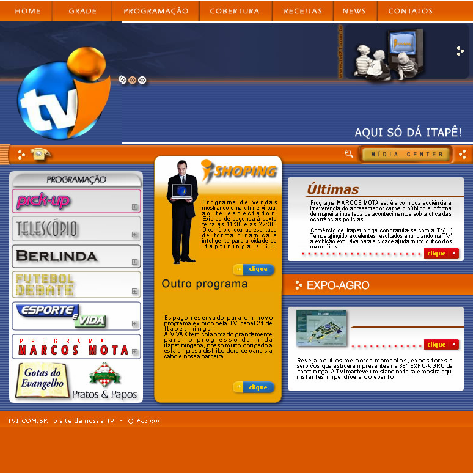

# Tvi Vivax Canal 21 - Version 3 (canceled)
by Francisco Mat
Made in 2005

Local television station, get in touch with me impressed by previous work: Banda Dookie Flash Site.

Finally I tried to follow client mockup, mixing Flash with HTML, but after insisting for receiving money for the previous work we ended up finishig the project and canceling future updated.

* Not sure about project date, in the files it would be version 1, but in my memory it was the last try, after tons of discussions.

## My first paid job
My first project for a paying client, I had made lots of projects before it, but in partnership mode and never charging, the experience was terrible, I feel like trapping, can't make creative contributions and have constant discuss about the work I want to do, that is why the same project had 3 versions and none was used, and receive the money became a real pain, I received about 20% of what was settled, but the client argued I did not finished the job. Huge experience, I was only 15 years old and no one to stand by me, helping and teaching me how to deal with new situations like unsatisfied costumers, had to learn by myself what to do, I tried remake the job 3 times than giveup.

* Tvi had changed its name to Tvitape
* Vivax to Horizon, then NET then Claro. 

Today's project actual name would be Tvitape Claro.

Francisco Matelli Matulovic - 2018